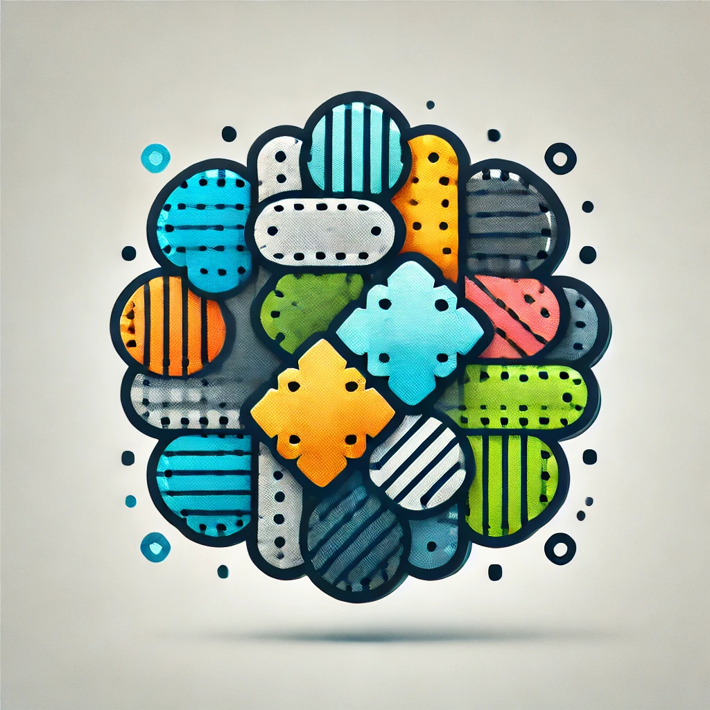

# Stitch

  

  <h1 align="center">Stitch</h1>
  <h3 align="center">"Game Engine"</h3>

 

<!-- Badges -->

  

  

# Welcome to the Stitch Wiki!

Stitch is a simple and VERY slowly growing "game engine" made by stitching together random code and hack solutions. :)

This is my first time doing something like this and feedback is very welcome. :3

If you want to use Stitch to do something with it, feel free to do so!!
